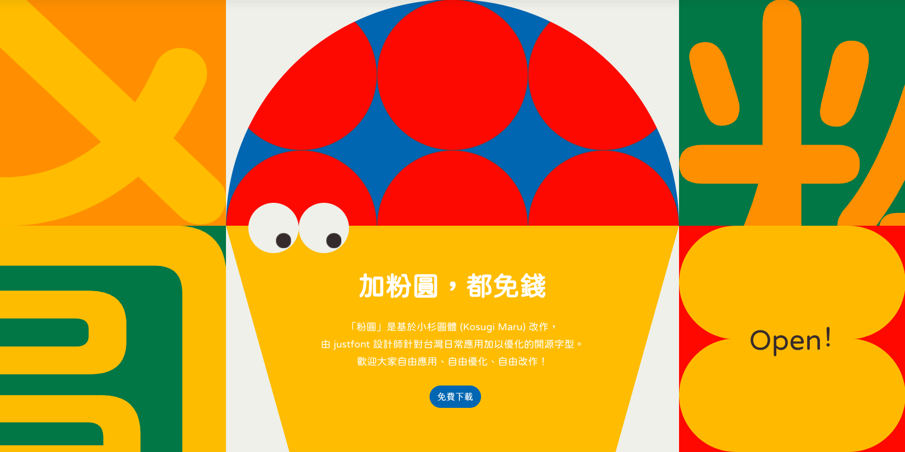
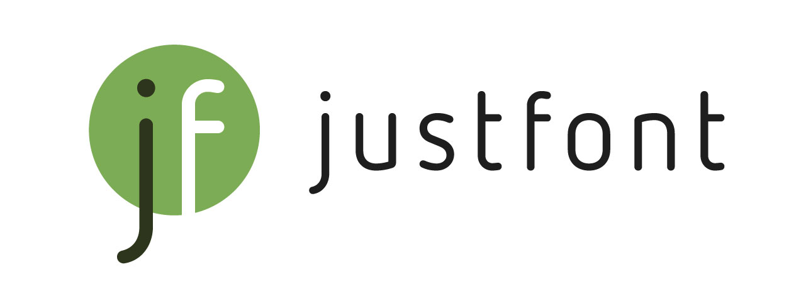

[README (English)](#jf-open-huninn) / [README (繁體中文)](#%E5%8A%A0%E7%B2%89%E5%9C%93%E9%83%BD%E5%85%8D%E9%8C%A2)

      

[![](https://img.shields.io/badge/jf_7000-Fully_Supported-66AC35?logo=data:image/svg+xml;base64,PHN2ZyBkYXRhLW5hbWU9IuWcluWxpCAxIiB4bWxucz0iaHR0cDovL3d3dy53My5vcmcvMjAwMC9zdmciIHZpZXdCb3g9IjAgMCAxOTMuMDcgMjQ3LjM4Ij48Y2lyY2xlIGN4PSI5Ni41MyIgY3k9Ijk2LjU5IiByPSI5Ni40NCIgc3R5bGU9ImZpbGw6I2ZmZiIvPjxwYXRoIGQ9Ik05NjAgNDE2LjMxYTk2LjU0IDk2LjU0IDAgMSAwIDAgMTkzLjA3YzIuOCAwIDUuNS0uMTQgOC4yMy0uMzdWNDg0LjQ0YTI5LjM1IDI5LjM1IDAgMCAxIDI5LjI1LTI5LjI1IDYyLjYgNjIuNiAwIDAgMSAxMi43MyAxLjMzYzMuOC45IDYuMjUgMy44IDYuMjUgNy4zNyAwIDQuNjktMy44IDcuMTQtNy4zNyA3LjE0LTMuNzkgMC02LjQ4LTEuMzMtMTEuNjEtMS4zM2ExNCAxNCAwIDAgMC0xNC4wNiAxNC4wNnYxOC4zaDI1LjY3YTcuMjkgNy4yOSAwIDAgMSA3LjM3IDcuMzcgNy4xIDcuMSAwIDAgMS03LjM3IDcuMTRoLTI1LjY2djg5Ljk0QTk2LjU0IDk2LjU0IDAgMCAwIDk2MCA0MTYuMzEiIHRyYW5zZm9ybT0idHJhbnNsYXRlKC04NjMuNDYgLTQxNi4zMSkiIHN0eWxlPSJmaWxsOiNhOWFhYTkiLz48cGF0aCBkPSJNNjQuNjEgMzguODhhMTAgMTAgMCAwIDAtMTAuMDcgMTAuMDUgMTAuMDUgMTAuMDUgMCAxIDAgMjAuMSAwIDEwIDEwIDAgMCAwLTEwLTEwLjA1bS0uMDMgNDQuNjRhNy42NyA3LjY3IDAgMCAwLTcuNTkgNy41OVYyMDYuM2MwIDE0LjA3LTcuMTQgMjMuODktMTkuNDEgMjYuNzlhNi45MyA2LjkzIDAgMCAwLTUuODEgNi45MiA3LjIzIDcuMjMgMCAwIDAgNy4xNCA3LjM3IDEwIDEwIDAgMCAwIDIuMjQtLjIzYzE4Ljc0LTMuNTcgMzEtMjAuNTQgMzEtNDEuNTJWOTEuMTFhNy42NyA3LjY3IDAgMCAwLTcuNTktNy41OSIgc3R5bGU9ImZpbGw6IzU5NWE1OSIvPjwvc3ZnPg==&style=flat-square)](https://github.com/justfont/jf7000) 

# jf open-huninn

**jf open-huninn** is an Open-Source Traditional Chinese Rounded Typeface project developed by [justfont](https://justfont.com). 

The typeface is released under the SIL Open Font License 1.1, and we welcome everyone to freely use, share, and modify it!

🔗 Visit the website: https://justfont.com/huninn/

## Download

- **The latest version is jf open-huninn 2.1**
- Download from official website: https://justfont.com/huninn/
- Download from Releases page: https://github.com/justfont/open-huninn-font/releases
- If you want use it as webfont or Google Workspace, check [Huninn]([https://](https://github.com/justfont/Huninn)) on [Google Fonts](https://fonts.google.com/specimen/Huninn)

## Changelog

- `1.0` (Mar. 14, 2020) 
  - First release.
- `1.1` (Apr. 4, 2020)
  - Added characters, including 301 Taiwanese and Hokkien characters.
  - Corrected some character outlines and curves.
  - Attempted to adjust potential misalignment in phonetic notation.
- `2.0` (Mar. 14, 2023)
  - Add and adjust 1,168 characters.
  - For detailed updates, see Releases page.
- `2.1` (Sep. 19, 2024)
  - Add and adjust 727 characters to fulfill [jf 7000 charset](https://justfont.com/jf7000) range.
  - For detailed updates, see Releases page.

## Story behind project

> The name **Huninn (粉圓)** is inspired by the Taiwanese term for tapioca pearls, reflecting a playful nod to local culture.

This project was initiated as a way to give back to the community following the success of the 2015 crowdfunding campaign for [JinXuan (金萱)](https://blog.justfont.com/2025/03/jinxuan-en/). As promised, an open-source font optimized for Taiwanese users was created and given as a gift to the Taiwanese community. 

The typeface is based on the Japanese existing open-source font [Kosugi Maru (小杉丸ゴシック)](https://github.com/googlefonts/kosugi-maru), originally developed by Motoya Co., Ltd and the Latin characters were replaced with another open-source font, [Varela Round](https://fonts.google.com/specimen/Varela+Round), designed by Joe Prince and Avraham Cornfeld, to ensure a cohesive and high-quality bilingual experience. 

The typeface includes commonly used characters in Taiwan, Zhuyin (Bopomofo) symbols, and even adds Taigi and Hokkien phonetic symbols and characters to meet local requirements.

Released under the [SIL Open Font License 1.1 (OFL 1.1)](https://openfontlicense.org/), The typeface is freely available for anyone to use without restrictions. It can be downloaded and used at no cost, with no requirement to notify or credit us. It is also suitable for commercial projects, as long as the typeface itself is not sold as a standalone product. Users are free to copy, distribute, and install it on any device or software without limitations. Additionally, the typeface can be modified or used as the basis for new works, provided that any derivatives are shared under the same SIL Open Font License.

❤️ Learn more about the Huninn story from [Huninn: A Free and Open-Source Font for Traditional Chinese | justfont blog](https://blog.justfont.com/2025/03/huninn-open-source-en/).

## Features

The design process involved reworking the original Kosugi Maru font, which featured uneven stroke weights and a distinctly Japanese aesthetic, to better suit Taiwanese typographic tastes. 

Additionally, justfont enhanced the font’s grayscale rendering and repositioned punctuation to conform to Traditional Chinese standards, improving its practicality for local uses such as documents, web design, and signage.

- **Glyph Expansion**: 
  - Building on this base, justfont tailored the font for everyday use in Taiwan. They expanded it by incorporating 1,477 frequently used Traditional Chinese characters, Taiwanese-specific phonetic symbols like Bopomofo , and characters for Taiwanese Hokkien Romanization (Tai-lo). 
  - In total, our team refined glyph shapes and added over 2,700 characters and symbols to better reflect common usage in Taiwan.
  
- **Design Refinements**: 
  - The character designs were polished to enhance legibility and visual balance. This included fine-tuning stroke weights, adjusting character spacing, and optimizing glyph proportions for a typeface that is both practical and aesthetically pleasing. 
  - Significant effort went into refining the “grayscale” of the characters, addressing the original’s inconsistent stroke thicknesses. 
  - We meticulously adjusted each stroke to achieve a more uniform and ideal appearance, ensuring that no characters appear overly dark or faint.
  
- **Typesetting Adjustments**: 
  - The original Kosugi Maru punctuation, designed for Japanese, positioned marks off-center within the grid. 
  - To align with Taiwan’s typesetting conventions, which require centered punctuation, we made key adjustments in developing open Huninn. 
  - These changes ensure the typeface meets the needs of our local audience effectively.

- **Fully Support jf7000 Charset**:
  - Read more about jf7000 Charset: [justfont/jf7000](https://github.com/justfont/jf7000).
  - Supports Taiwanese and Hakka Romanization writing

## License

jf open-huninn is released under the **SIL Open Font License 1.1**. You are free to:

- **Use**: Freely use or download this font without payment, notification, or attribution, including for commercial purposes, as long as the font itself is not sold as a product.
- **Distribute**: Freely share, copy, or install this font on any firmware, software or hardware.
- **Modify**: Freely modify this font to create derivative designs, which must also be released under the SIL Open Font License.

For full licensing details, see:

- SIL Open Font License 1.1 - SPDX: https://spdx.org/licenses/OFL-1.1.html

## Special Thanks

We particularly thank Japan MOTOYA Company for open-sourcing their [*Kosugi Maru*](https://github.com/googlefonts/kosugi-maru), American designer Joe Prince, and Israeli designer Avraham Cornfeld for open-sourcing the [*Varela Round*](https://fonts.google.com/specimen/Varela+Round). Your contributions have enabled us to build upon the work of our predecessors. We also extend our gratitude to all the supporters of the [Jin Xuan Crowdfunding Project in 2015](https://www.flyingv.cc/projects/8250/), as jf open-huninn is your gift to Taiwan!

- MOTOYA (*Kosugi Maru*), Joe Prince, and Avraham Cornfeld (*Varela Round*), [@NightFurySL2001](https://github.com/NightFurySL2001) (*Tangyuan-font*)
- All sponsors of the [Jin Xuan Crowdfunding Project](https://www.flyingv.cc/projects/8250/)
- [Backer-Founder](https://backer-founder.com/) for their support in the crowdfunding project
- [@ButTaiwan](https://github.com/ButTaiwan)
- All the passionate typeface enthusiasts!

## Disclaimer

This font is released under an open-source license. We assumes no responsibility for any issues related to the download, installation, or use of this typeface, nor for any potential damage that may result.

Furthermore, although we have check the typeface multiple times, we do not guarantee that it is completely free of errors. If you intend to use this typeface in formal settings, please verify and correct the text's accuracy yourself.

---

# 加粉圓，都免錢

**「jf open 粉圓（open-huninn）」** 是基於小杉圓體（Kosugi Maru）、

由[ justfont](https://justfont.com) 的設計師們針對臺灣日常應用加以調整的開源字型，

以 SIL Open Font License 1.1 授權釋出，

歡迎大家自由應用、自由調整、自由改作！

歡迎大家到粉圓的官網看看喔： https://justfont.com/huninn/ 

## 下載方式

- **最新版本為 jf open 粉圓 2.0**
- 到 justfont 的官網下載：https://justfont.com/huninn/
- 到 Releases 的頁面下載： https://github.com/justfont/open-huninn-font/releases
- 如果你需要 webfont、或是在 Google Workdpace 上使用，可以參考  [Google Fonts](https://fonts.google.com/specimen/Huninn) 上的 [Huninn]([https://](https://github.com/justfont/Huninn))。

## 更新紀錄

- `1.0` (2020/03/14) 
  - 初次對外公開，以 TrueType 格式釋出。  
- `1.1` (2020/04/20)   
   - 新增字符，包含「本土語言外字表」表列的臺客語漢字，共 301 字。  
   - 更正某些字的輪廓與曲線錯誤。  
   - 嘗試排除臺客語羅馬字標音中，可能出現錯誤位移的狀況。  
- `2.0` (2023/03/14) 
  - 粉圓在今年將滿三歲了，一直以來很謝謝大家的支持！
  - 在這次的更新之後，除非未來發現嚴重錯誤（如碼位錯置、筆畫錯誤、字體檔案本身損毀等），否則此版本的粉圓將會是 justfont 維護的最後一個版本。
  - 詳細更新的內容，請見 [Releases 紀錄](https://github.com/justfont/open-huninn-font/releases) 。
- `2.1` (2024/09/19)
  - 增補字符，滿足 [jf 7000](https://justfont.com/jf7000) `v0.9` 字符集需求。
  - 詳細更新的內容，請見 [Releases 紀錄](https://github.com/justfont/open-huninn-font/releases) 。

## 食粉圓，拜樹頭

在 2015 年的「[金萱字型](https://justfont.com/jinxuan/)」成功募資後，justfont 便承諾以既有開源字型為基礎進行調整，為臺灣的使用者釋出一套新的開源作品。  

在此，我們特別感謝日本 MOTOYA 公司開源旗下的[「小杉圓體」（Kosugi Maru, 小杉丸ゴシック）](https://github.com/googlefonts/kosugi-maru)字型、美國設計師 Joe Prince 與以色列設計師 Avraham Cornfeld 開源 [Varela Round](https://fonts.google.com/specimen/Varela+Round) 字體，因為你們的貢獻與付出，我們才能站在前人的肩膀上，惠及後人；更要感謝的是，所有金萱募資案的贊助者在 2015 年對我們的支持，jf open 粉圓是你們獻給臺灣的禮物！

## 古椎得人疼 ê 臺灣口味

針對臺灣的使用與排版需求，justfont 於小杉圓體原有的日文字型基礎上，增補了臺灣常用字、注音符號，甚至增加了臺客語拼音與漢字，以適應臺灣的使用需求。除了字符之外，設計師們也修訂排版設定、改進了原有字體的灰度品質，讓你的排版更為美麗！

大致來說，新的「jf open 粉圓」字型有以下變動：

- **筆形設計**：針對原本字符筆畫粗細不均勻、佈局未盡理想的狀況進行調整與修正。
- **排版調整**：「小杉圓體」原為日文字型標點符號設計，「jf open 粉圓」則改為繁體中文標點符號設置。
- **增補字符**：補齊日文字型中不包含的臺灣常用漢字與臺客語漢字，共近 2,700 餘字，並另外設計注音符號與臺客拼音符號。

## 用都用，放心用

jf open 粉圓基於 SIL Open Font License 1.1 開源協議授權釋出。您可以放心地：

- **自由應用**：無需付費、知會或標明原作者，即可自由使用或研究本字型，亦可用為商業應用，惟不可將本字體作為產品販售。
- **自由散布**：可自由分享、複製本字體檔案，或是將字體檔案安裝於任何軟硬體中。  
- **自由改作**：可自由將字型檔案修改重製為其他字型檔案，惟改作後的字型檔案仍須同樣依 SIL Open Font License 釋出。

完整的授權規定詳見：

- SIL Open Font License 1.1 - SPDX：https://spdx.org/licenses/OFL-1.1.html
- 中譯參考版本：http://florenceko.me/?p=2089

## 特別感謝

- MOTOYA（小杉丸ゴシック）、Joe Prince 與 Avraham Cornfeld (Varela Round)、[@NightFurySL2001](https://github.com/NightFurySL2001)（糖圓體）
- [金萱募資專案](https://www.flyingv.cc/projects/8250/)中的所有贊助者
- [貝殼放大](https://backer-founder.com/)在金萱募資專案中的支持  
- 柯志杰 [@ButTaiwan](https://github.com/ButTaiwan) 先生在本專案中的協助和校對 
- 所有熱愛字的好夥伴們

***

# 關於 justfont

justfont 官方網站： [https://justfont.com](https://bit.ly/3TUYi3r)

字體不但佔據閱讀的目光，也引導了生活中的每個決定。字體更構築了城市街道的風景，是關乎美感，最重要的視覺纖維。在人人都能用字型的時代，更能透過方便的科技，將專家職人的心血結晶應用在生活中。

可惜，臺灣長期以來，不論學院或產業，字體都未能得到足夠關注，也缺乏深度耕耘。不僅導致設計從業者能力斷層，一般民眾也對每日都會用到的字體缺乏認識。長久以往，街道上充斥不易理解、不甚美觀的字體排印。版權觀念薄弱，盜版盛行，更導致字型廠商在消費端無立足之地，紛紛轉型或外移。如此負向循環，讓臺灣的「文字風景」難以起色。

justfont 相信字體的價值，更相信好的字體能啟發社會。除了細心栽培一筆一劃，我們更願做字體推廣教育的先行者、教育者與輔導者，致力於培育臺灣下一代的設計力量。從基礎建設與教育開始，提升臺灣的美學環境。邀請您一起來，創造更好的文字風景。

***

# 免責事項

本字型基於開源授權釋出，對本字型的下載、安裝、與安裝後相關之問題，及可能導致之一切可能損害，justfont 皆不承擔相關責任。

此外，我們雖然經過數次校對，但並不擔保字型內絕對沒有錯誤。若您有應用在正式場合的需求，請自行確認、校正文字之正確性。
